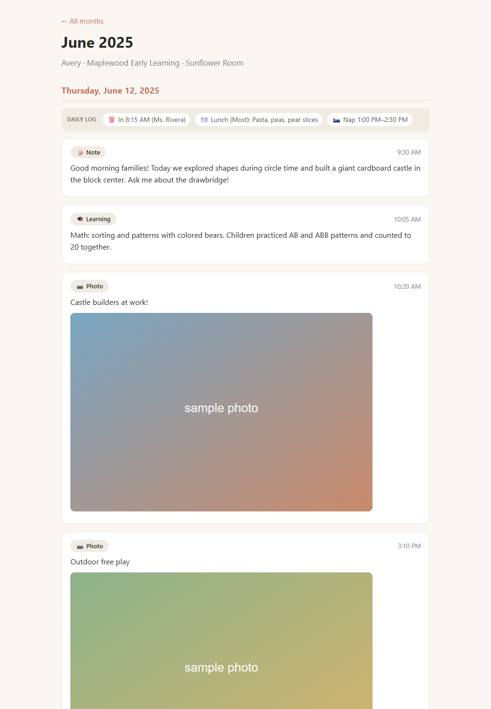

# Procare Downloader & Scrapbook

Download **all** of your child's photos and videos from the [Procare](https://www.procaresoftware.com/)
(Procare Connect) parent app to your own computer — each file keeps its **original date** — and
build a browsable **scrapbook** of the whole year (teacher notes, learning activities, photos,
and videos) that opens in any web browser.

Procare gives parents no "download everything" button, and access to a year of memories can
disappear when a child leaves or a subscription lapses. This tool saves it all, locally.

<p align="center">
  
  <br><em>The generated scrapbook — a browsable monthly timeline (sample data shown).</em>
</p>

> **Unofficial.** Not affiliated with or endorsed by Procare. It uses the same private API the
> Procare web/mobile app uses, so it may break if Procare changes their service. Use it only for
> your **own** child's account. Provided as-is, with no warranty.
>
> **Private by design.** Everything runs on your computer. Your password is entered at a hidden
> prompt, used only to log in, and is **never saved or sent anywhere** except to Procare.

---

## Download & run (no Python needed)

Most people should just grab the prebuilt app:

### ➡️ [**Download the latest release**](https://github.com/eyedocnyc/procare-downloader/releases/latest)

- **Windows:** download `ProcareDownloader-Windows.zip`, unzip, double-click `ProcareDownloader.exe`.
  First launch shows *"Windows protected your PC"* (the app is unsigned) → **More info → Run anyway**.
- **Mac (Apple Silicon, 2020+):** download `ProcareDownloader-Mac.zip`, unzip, double-click
  `ProcareDownloader`. First launch is blocked by Gatekeeper → **right-click → Open → Open**
  (one time only). *(Older Intel Macs aren't supported by the prebuilt app — run from source instead.)*

Then just follow the prompts:

1. Choose **option 1** (download everything + build the scrapbook).
2. Enter your Procare **email** and **password**.
3. It downloads your media (the first run can take a while) and opens your scrapbook when done.

Everything is saved next to the app in a `procare_media` folder. Open **`Open Scrapbook.html`** to
browse it.

---

## What you get

- **All photos and videos**, full resolution, organized into monthly folders.
- **Correct dates:** photos keep their capture date in EXIF; every file's date is set to when it
  was taken, so they sort correctly in Photos, Google Photos, or your file browser.
- **A scrapbook** — one HTML page per month plus a front page — showing each day's teacher notes
  and learning activities with the photos and videos embedded inline. Routine logs (meals, naps,
  sign in/out, bathroom) are condensed into a compact "daily log" line per day. The scrapbook is
  titled with your child and class (e.g. *"Maya's Year in Emerald Lilies"*).

```
procare_media/
  Open Scrapbook.html              <- open this
  2025-06 (June 2025).html         <- one page per month
  2025-06/                         <- that month's photos & videos
  assets/scrapbook.css
  feed.json                        <- raw archive of the full activity feed
```

**Multiple classes/years?** When run interactively, the app lists the classes it finds (with date
ranges) and lets you pick one — handy for making a scrapbook for a single class or school year.

---

## Run from source (advanced)

Requires [Python 3.9+](https://www.python.org/downloads/).

```bash
git clone https://github.com/eyedocnyc/procare-downloader.git
cd procare-downloader
pip install -r requirements.txt
python procare_download.py --scrapbook
```

### Options

| Option | What it does |
|--------|--------------|
| `--email` | Your Procare login email (asks if omitted) |
| `--out` | Output directory (default `procare_media`) |
| `--scrapbook` | Build the HTML scrapbook after downloading |
| `--scrapbook-only` | Rebuild the scrapbook without re-downloading (uses `feed.json`) |
| `--zip` | Bundle the whole output folder into one `.zip` |
| `--school "Name"` | Optional school name to show on the scrapbook (omitted by default) |
| `--class-name "Name"` | Class/room name (auto-detected from the feed if omitted) |
| `--since YYYY-MM-DD` | Only include media on/after this date |
| `--until YYYY-MM-DD` | Only include media on/before this date |
| `--overwrite` | Re-download files that already exist |
| `--videos-only` | Only process videos |
| `--debug` | Save one sample of each activity type to `debug_activities.json` |

Running with **no arguments** (or double-clicking the app) starts a friendly guided menu.

---

## Building the apps

Prebuilt apps are produced automatically by [GitHub Actions](.github/workflows/build.yml): pushing
a version tag (`git tag v1.1 && git push origin v1.1`) builds the Windows and Mac apps and
publishes them to a **Release**. The Mac binary is built for Apple Silicon (M-series, 2020+).

To build locally instead:

- **Windows:** double-click `build_exe.bat` (needs Python). Produces
  `dist/ProcareDownloader.exe` and `dist/ProcareDownloader-Windows.zip`.
- **Mac:** double-click `build_mac.command` (needs Python; must be run on a Mac). Produces
  `dist/ProcareDownloader` and `dist/ProcareDownloader-Mac.zip`.

Both call `package_app.py` to assemble the shareable zip.

---

## Troubleshooting

- **"Login failed: email or password is incorrect."** Verify at
  [schools.procareconnect.com](https://schools.procareconnect.com/). If you sign in with
  Google/Apple, set a regular Procare password first ("Forgot password").
- **Two-factor authentication (2FA) / login codes aren't supported.** The tool signs in with
  just your email and password. If your account requires a verification code, login won't work.
- **A video won't play.** Re-run with `--overwrite` to refetch it.
- **Scrapbook shows "media file not found."** Do a normal download first, then `--scrapbook-only`.
- **From source: `python`/`pip` not recognized.** Python isn't on your PATH — reinstall and tick
  "Add Python to PATH", or try `py` instead of `python`.

## Notes & limitations

- Uses Procare's private API (no official public API exists for this); it may break if Procare
  changes their backend.
- Only downloads what your own parent account can see — photos your child is tagged in, plus the
  activity feed for your child.
- The apps are unsigned, hence the one-time SmartScreen/Gatekeeper prompts. Code signing requires
  paid developer certificates and isn't worth it for a personal tool.

## Disclaimer

- This project is **not affiliated with, endorsed by, sponsored by, or connected to Procare
  Solutions** or any of its products. "Procare" and any related names or logos are trademarks of
  their respective owners and are used here only to describe what the tool interacts with.
- It is an **independent, unofficial** tool that uses Procare's private API the same way the
  official app does. There is no guarantee it will keep working; Procare may change or block it
  at any time.
- It is intended for **personal use only** — to let a parent or guardian save and keep a copy of
  **their own child's** photos, videos, and activity records that they already have access to.
  Do not use it to access any account or data that isn't yours, and don't use it for commercial
  purposes.
- You are responsible for using it in compliance with Procare's Terms of Service and any
  applicable laws. Handle the downloaded files and your credentials responsibly.
- Provided **"as is", without warranty of any kind**, express or implied. The authors and
  contributors accept **no liability** for any loss, damage, or other consequences arising from
  its use. Use at your own risk.

## License

Provided as-is for personal use. See the Disclaimer above. Not affiliated with Procare Solutions.
