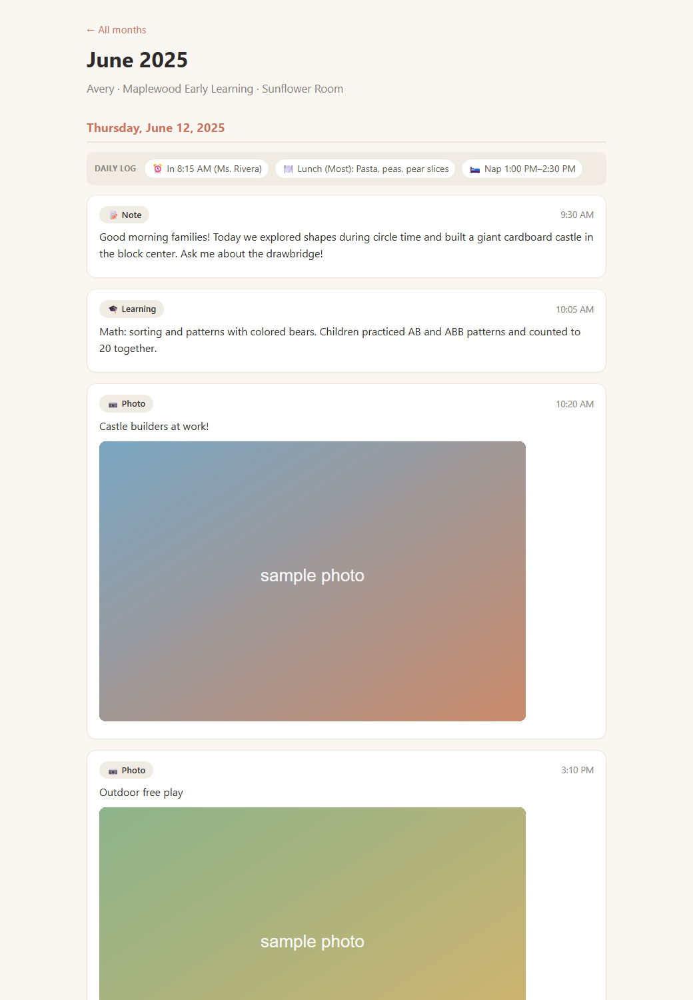

# Procare Downloader & Scrapbook

Download **all** of your child's photos and videos from the [Procare](https://www.procaresoftware.com/)
(Procare Connect) parent app to your own computer — each file keeps its **original date** — and
build a browsable **scrapbook** of the whole year (teacher notes, learning activities, photos,
and videos) that opens in any web browser.

Procare gives parents no "download everything" button, and access to a year of memories can
disappear when a child leaves or a subscription lapses. This tool saves it all, locally.

<p align="center">
  
  <br><em>The generated scrapbook — a browsable monthly timeline (sample data shown).</em>
</p>

> **Unofficial.** Not affiliated with or endorsed by Procare. It uses the same private API the
> Procare web/mobile app uses, so it may break if Procare changes their service. Use it only for
> your **own** child's account. Provided as-is, with no warranty.
>
> **Private by design.** Everything runs on your computer. Your password is entered at a hidden
> prompt, used only to log in, and is **never saved or sent anywhere** except to Procare.

---

## Download & run (no Python needed)

Most people should just grab the prebuilt app:

### ➡️ [**Download the latest release**](https://github.com/eyedocnyc/procare-downloader/releases/latest)

- **Windows:** download `ProcareDownloader-Windows.zip`, unzip, double-click `ProcareDownloader.exe`.
  First launch shows *"Windows protected your PC"* (the app is unsigned) → **More info → Run anyway**.
- **Mac (Apple Silicon, 2020+):** download `ProcareDownloader-Mac.zip`, unzip, double-click
  `ProcareDownloader`. First launch is blocked by Gatekeeper → **right-click → Open → Open**
  (one time only). *(Older Intel Macs aren't supported by the prebuilt app — run from source instead.)*

Each release also includes a `.sha256` checksum file if you'd like to verify your download
(`sha256sum ProcareDownloader-Windows.zip` on Windows/Linux, `shasum -a 256 …` on Mac). Note a
checksum only proves your download matches the file published beside it on the release page — it
confirms the download wasn't corrupted or swapped in transit, not who authored it. (The apps are
unsigned, so Windows SmartScreen / macOS Gatekeeper will still warn on first launch.)

Then just follow the prompts:

1. Choose **option 1** (download everything + build the scrapbook).
2. Enter your Procare **email** and **password**.
3. It downloads your media (the first run can take a while) and opens your scrapbook when done.

Everything is saved next to the app in a `procare_media` folder. Open **`Open Scrapbook.html`** to
browse it.

### Staying up to date

On launch the app checks GitHub for a newer release. If there is one, it tells you and asks whether
to update — say yes and it downloads the new version, **verifies it against the published SHA-256**,
and swaps itself in place, then restarts on the new version. (Because the app downloads the update
itself, the updated app usually launches without the one-time SmartScreen/Gatekeeper prompt.) Pass
`--no-update-check` to skip the check, or `--version` to see which version you have. Running from
source? The check just points you at the latest release / `git pull` instead.

---

## What you get

- **All photos and videos**, full resolution, organized into monthly folders.
- **Correct dates:** photos keep their capture date in EXIF; every file's date is set to when it
  was taken, so they sort correctly in Photos, Google Photos, or your file browser.
- **A scrapbook** — one HTML page per month plus a front page — showing each day's teacher notes
  and learning activities with the photos and videos embedded inline. Routine logs (meals, naps,
  sign in/out, bathroom) are condensed into a compact "daily log" line per day. The scrapbook is
  titled with your child's name, with the class(es) they were in shown underneath (every class gets
  its own date range if they moved partway through). Click any photo to view it full-screen, and the
  front page shows a summary (photos, videos, notes, date range, busiest month).

```
procare_media/
  Open Scrapbook.html    <- open this (the only page at the top level)
  Scrapbook/             <- the month-by-month pages (+ styling, feed.json)
  Media/                 <- all photos & videos, organized by month (YYYY-MM/)
```

**Multiple classes/years?** When run interactively, the app lists the classes it finds (with date
ranges) and lets you pick one — handy for making a scrapbook for a single class or school year.

**More than one child?** Each child gets their **own** date-range choice and class name, with their
media under `Media/<Child>/` and pages under `Scrapbook/<Child>/`. The top-level `Open Scrapbook.html`
lets you pick which child to open.

---

## Run from source (advanced)

Requires [Python 3.9+](https://www.python.org/downloads/).

```bash
git clone https://github.com/eyedocnyc/procare-downloader.git
cd procare-downloader
pip install -r requirements.txt
python procare_download.py --scrapbook
```

### Options

| Option | What it does |
|--------|--------------|
| `--email` | Your Procare login email (asks if omitted) |
| `--out` | Output directory (default `procare_media`) |
| `--scrapbook` | Build the HTML scrapbook after downloading |
| `--scrapbook-only` | Rebuild the scrapbook without re-downloading (uses `feed.json`) |
| `--zip` | Bundle the whole output folder into one `.zip` |
| `--school "Name"` | Optional school name to show on the scrapbook (omitted by default) |
| `--class-name "Name"` | Class/room name (auto-detected from the feed if omitted) |
| `--since YYYY-MM-DD` | Only include media on/after this date |
| `--until YYYY-MM-DD` | Only include media on/before this date |
| `--overwrite` | Re-download files that already exist |
| `--videos-only` | Only process videos |
| `--debug` | Save one sample of each activity type to `debug_activities.json` |

Running with **no arguments** (or double-clicking the app) starts a friendly guided menu.

---

## Building the apps

Prebuilt apps are produced automatically by [GitHub Actions](.github/workflows/build.yml): pushing
a version tag (`git tag v1.1 && git push origin v1.1`) builds the Windows and Mac apps and
publishes them to a **Release**. The Mac binary is built for Apple Silicon (M-series, 2020+).

To build locally instead:

- **Windows:** double-click `build_exe.bat` (needs Python). Produces
  `dist/ProcareDownloader.exe` and `dist/ProcareDownloader-Windows.zip`.
- **Mac:** double-click `build_mac.command` (needs Python; must be run on a Mac). Produces
  `dist/ProcareDownloader` and `dist/ProcareDownloader-Mac.zip`.

Both call `package_app.py` to assemble the shareable zip.

---

## Troubleshooting

- **Windows says "Smart App Control blocked an app that may be unsafe" (no "Run anyway" option).**
  This is a different, stricter mechanism than the usual SmartScreen warning above — it has no
  in-dialog override, and it blocks any unsigned/unrecognized app regardless of what it does. If you
  hit this, the practical workaround is to **run from source** instead (see below) — that's just
  Python + a script, not an unsigned binary, so Smart App Control doesn't apply to it. You *can*
  disable Smart App Control in Windows Security → App & browser control, but on most Windows 11
  builds that's a **one-way switch** (you can only turn it back on via a clean reinstall of Windows),
  so it's not something to do lightly just to run this tool.
- **"Login failed: email or password is incorrect."** Verify at
  [schools.procareconnect.com](https://schools.procareconnect.com/). If you sign in with
  Google/Apple, set a regular Procare password first ("Forgot password").
- **Two-factor authentication (2FA) / login codes aren't supported.** The tool signs in with
  just your email and password. If your account requires a verification code, login won't work.
- **A video won't play.** Re-run with `--overwrite` to refetch it.
- **Scrapbook shows "media file not found."** Do a normal download first, then `--scrapbook-only`.
- **From source: `python`/`pip` not recognized.** Python isn't on your PATH — reinstall and tick
  "Add Python to PATH", or try `py` instead of `python`.

## Security & privacy

- **Your password** is entered at a hidden prompt, used only to log in to Procare, and is never
  saved or written anywhere.
- **Your login token goes only to Procare.** The tool attaches your session token *exclusively* to
  requests to Procare's own API hosts (`api-school.procareconnect.com` / `api-school.kinderlime.com`).
  The actual photos and videos are downloaded from Procare's CDN over separate, **unauthenticated**
  requests — those links are already signed, so your token is never sent to the CDN or anywhere
  off-domain.
- **The output is unencrypted and sensitive.** The `Media` folder, the `Scrapbook` HTML, and
  `Scrapbook/feed.json` contain your child's photos, videos, names, and daily records in the clear.
  Keep the folder somewhere private, and think before emailing it or sharing the ZIP publicly —
  anyone with the files has everything in them. (`feed.json` has expiring/signed media links stripped
  out, so a shared archive can't hand out working URLs, but the local media itself is still right
  there in the folder.)
- **`--debug` writes extra sensitive data.** It dumps sample activity records to
  `debug_activities.json` for troubleshooting. Signed URLs are stripped from it, but it still
  contains real activity content — delete it when you're done, and don't share it casually.
- **2FA / SSO accounts aren't supported.** Login is email + password only; if your account requires
  a verification code or signs in via Google/Apple, the tool can't authenticate.

## Notes & limitations

- Uses Procare's private API (no official public API exists for this); it may break if Procare
  changes their backend.
- Only downloads what your own parent account can see — photos your child is tagged in, plus the
  activity feed for your child. Some daycares upload videos to a shared gallery that isn't tagged
  per child; with more than one child on the account, those land in a **"Shared Gallery"** section
  rather than being guessed into one child's scrapbook.
- The apps are unsigned, hence the one-time SmartScreen/Gatekeeper prompts. Code signing requires
  paid developer certificates and isn't worth it for a personal tool.

## Disclaimer

- This project is **not affiliated with, endorsed by, sponsored by, or connected to Procare
  Solutions** or any of its products. "Procare" and any related names or logos are trademarks of
  their respective owners and are used here only to describe what the tool interacts with.
- It is an **independent, unofficial** tool that uses Procare's private API the same way the
  official app does. There is no guarantee it will keep working; Procare may change or block it
  at any time.
- It is intended for **personal use only** — to let a parent or guardian save and keep a copy of
  **their own child's** photos, videos, and activity records that they already have access to.
  Do not use it to access any account or data that isn't yours, and don't use it for commercial
  purposes.
- You are responsible for using it in compliance with Procare's Terms of Service and any
  applicable laws. Handle the downloaded files and your credentials responsibly.
- Provided **"as is", without warranty of any kind**, express or implied. The authors and
  contributors accept **no liability** for any loss, damage, or other consequences arising from
  its use. Use at your own risk.

## License

Provided as-is for personal use. See the Disclaimer above. Not affiliated with Procare Solutions.
